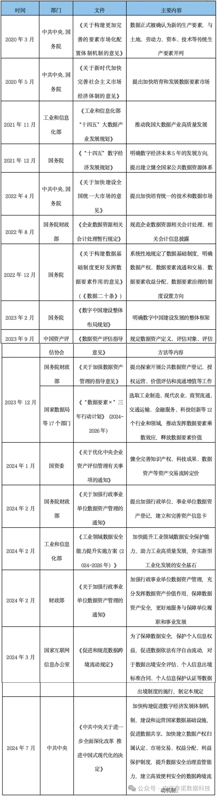
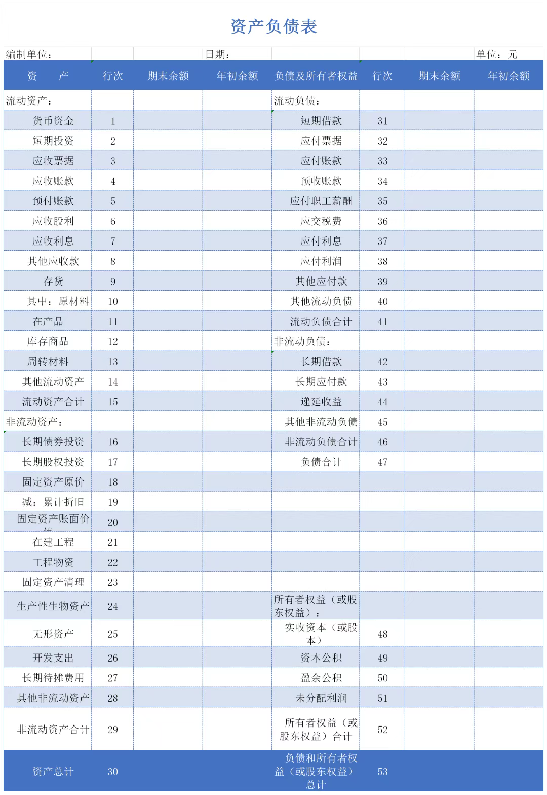

# 数据资产入表，“资源”变“资产”？

时间：2025 年 11 月 14 日 8:16

> “数据资产入表” 这一概念一定不陌生，它现已成为企业财务管理与战略布局中无法回避的关键议题。那么，究竟什么是数据资产入表？哪些数据有资格登上企业财务报表的 “舞台”？入表的目的、条件、好处又分别是什么？

本文将聚焦数据资产入表，从资产入表政策、路径、痛点等方面进行分析，并结合数据资产入表业务中作为律师的相关工作，为企业开展数据资产入表业务提供参考。

## 数据资产入表概念及功能

### 数据资产

资产是指有企业过去的交易或事项形成的，由企业拥有或控制的，预期会给企业带来经济利益的资源。而数据资产具有资产的基本特征，是数字经济背景下以数据形态存在的资产。《信息技术服务数据资产管理要求》（GB/T40685-2021）定义数据资产是“企业合法拥有或控制的，能进行计量的，为组织带来经济和社会价值的数据资源”。中国通信研究院将数据资产定义为“由组织（政府机构、企事业单位等）合法拥有或控制的数据资源，以电子或其他方式记录，例如文本、图像、语音、视频、网页、数据库、传感信号等结构化或非结构化数据，可进行计量或交易，能直接或间接带来经济效益和社会效益”。可见，数据资产是企业生产、交易过程中记录的数据信息。企业能够对拥有的数据资产在获取、存储、处理和使用等环节进行有效的管理和控制，促使数据资产能够为企业带来直接或间接的经济价值。但需注意，数据资产作为现代经济的一种重要资源，具有较强的场景依附性，它的价值与使用的场景高度相关，同样的数据，在不同业务中所创造的经济价值也不尽相同。

### 数据资产入表

“入表”是计入财务报表的简称。数据资产入表是指数据资源在满足一定条件下被计入财务报表。2023年8月22日，财政部发布的《企业数据资源相关会计处理暂行规定》（以下简称为“《暂行规定》”）对数据资产入表提供了原则性的指导，在我国数字经济发展中具有里程碑地位。一方面，《暂行规定》按照数据资源的经济利益的预期消耗方式及业务模式，将数据资源分类为无形资产和存货科目进行确认、计量和报告。另一方面，该文件对数据资源的列示与披露也做了细化规定，同时创造性地对数据资源采取“强制披露加自愿披露”的方式，以推动企业数据资源向数据资产转变，形成规范的数据资产开发、运营和管理体系，提升企业数据治理能级，释放数据价值。

### 数据资产入表的意义

- 宏观层面
  1. 激活数据要素市场数据资产入表意味着数据能够进行买卖、交易以及抵押，进一步促进了数据的流通与共享，让更多的企业获取并运用数据，助推数字经济实现创新发展。同时，活跃的数据市场会进一步吸引更多投资，从而推动数字经济的发展。
  2. 促进数字经济与实体经济深度融合数据资产入表这一举措，对于打破横亘在数字经济与实体经济之间的壁垒意义重大，能够有力地推动二者深度融合。数据资产被纳入财务报表之后，企业对自身的数据价值会形成更为明确的认知，进而对生产、管理和营销等环节予以优化，切实增强实体经济的运行效率与竞争力。
- 微观层面
  1. 提升企业的管理和风控效率数据资源入表后，可从资产、负债、利润角度更准确地反映企业财务状况和经营成果，为企业做出经营决策提供更好的依据。同时，数据资产入表一定程度上让企业的数据资源可视化，促使企业将有限的资源投入到效益最高的领域，为企业整体的运营效率赋能，提升企业的管理和风控效率。
  2. 提升企业的融资能力诸如中国工商银行、中国建设银行等众多银行金融机构纷纷施行了专门面向数据资产的融资授信以及质押抵押服务，“数据入表+融资”的模式正在趋于完善。数据资源入表正助推数据向资产进行转化，而数据资产化之后的资本化运用，为释放数据资产在金融价值层面潜能具有极为重要的推动作用。（3）推动企业数字化转型数据资产入表还将推动企业在价值创新方面的新探索。通过数据的分析和应用，企业可发现新的市场需求、开发出新的产品和服务，从而加快企业数字化转型步伐，提高信息化水平，实现价值的创新和增长。

## 数据资产入表政策依据

中共中央、国务院、财政部及各地方等发布的各类政策文件是当下数据资产入表的重要合规依据，下文对国家及陕西省层面与数据资产化相关政策进行了归纳和梳理，并对主要内容进行了摘录陈述。

## 资产负债表是什么

学过财务知识的朋友们肯定对资产负债表非常熟悉。如果要了解一个企业的财务状况，最简洁明了的方式就是去看它的资产负债表。资产负债表用于展示一个企业在特定日期的财务状况，它列出了企业的资产、负债和所有者权益，遵循会计方程式：资产（Assets）= 负债（Liabilities）+ 所有者权益（Owner's Equity），资产负债表提供了企业财务状况的快照，帮助投资者、债权人和管理层评估企业的财务健康程度、偿债能力和资本结构。所有的上市公司对外都需要披露这一张表，作为企业经营状况的展现。

## 什么样的数据可以入表？

只要是数据都能入表吗？显然不是。能成为资产的应当是有用的数据，但是“有用”要如何界定呢？《规定》给出了解释。

有用的数据分为三类：

- 第一类是将企业数据资源同其他资源相结合使用，可以服务支持其他生产经营或管理活动，实现提质、降本、增效、流程再造等目的；
- 第二类是运用企业数据资源可以为其他主体提供有关服务的；
- 第三类是直接交易原始数据或加工后的数据，与数据资源有关的经济利益通过转让数据资源而消耗。

符合这三类之中任意一条的数据就是数据资产，可以入表。

## 数据资产入表有什么好处？

企业最关心的问题可能是数据入表之后，能带来哪些好处。数据资产入表确实能为企业带来很多切实利益：

首先，数据资产入表是企业顺势响应国家政策方针的重要事务，数据资产成为企业财务报表中的新增项，宜早不宜迟，越先实施可能越具有先发优势。通过数据资产入表，企业可以更加清晰地了解自己的数据资产状况，激励核心部门更好地思考如何更好地收集、存储、分析和利用数据，提升自身的数据治理水平，为制定数据战略和优化资源配置提供有力支持。

其次，企业数据资源在企业财务报表中由费用化转化为资产项后，可以改善企业资产的组成结构，企业的利润率、资产负债率等关键性财务指标也可以得到优化，有助于提升企业估值，相当于新增了一项资产，并且数据越多的企业新增的资产也越多。尤其是对于高科技企业而言，数据资产入表会提高资产负债表、利润表信息与投资者决策的相关性，可以更加客观地反映出新质生产力相关企业的真实价值。

再次，很多企业在实施数字化转型项目的时候会有较大的支出，通过数据资产入表，企业在数字化转型方面的部分支出可以由损益类变为资产类，用数据资产来托底缓慢见效型数字化投资，降低数字化转型风险。

最后，企业数据资产入表账面价值是数据资本融信、证券运营的基础和依据，企业可开展股权债权融资、数据信托、质押融资、数据资产保险、数据资产担保、数据资产证券化等活动，为企业带来更多的流动资金支持。

## 数据资产入表有什么难点？

说完了好处，让我们来聊聊数据资产入表在操作上的难点：

- 难点1：需要多部门参与，配合难数据资产入表是企业一项重要战略工作，具体实施需要业务部门、信息化部门、财务部门的共同协作参与，涉及多个流程环节，部门间参与配合难。
- 难点2：成本分摊、收益预测难数据资产入表过程中存在成本归集难、摊销年限确定难、数据价值核算难等一系列难题，需要企业结合自身情况形成科学专业的计量核算方式。
- 难点3：数据合规难
数据资产往往不仅量大，并且来源、合规性证明难以追溯，可能面临审计部门的质疑。

## 企业数据资产入表路径

现阶段，企业进行数据资产入表的路径主要有以下三种：

**（一）以数据资源形式直接入表**
指企业将数据资源的历史成本直接确认为资产，具体有两种情形：1、企业自用的数据资源，符合《企业会计准则第6号——无形资产》规定的条件的，可确认为无形资产予以入表；2、企业对外出售（提供）不经任何加工的数据，即原始数据，并以相关数据集/库入表。

**（二）以数据产品形式入表**
企业将持有的数据资源进行一定程度的加工，形成可对外出售或提供服务的数据产品，再以数据产品的形式入表。数据产品根据是否在交易所挂牌交易分为场内挂牌数据产品和场外不挂牌数据产品。需注意，数据产品是否挂牌并非入表的必须条件，但因为场内交易多数强制要求对数据产品进行合规评估，故在场内数据交易场所挂牌成为不少企业的选择。

**（三）非同一控制下企业合并造成的数据资产入表**
非同一控制下的企业合并中，购买方收购价款高于标的公司可辨认净资产时，二者的差额可被计入无形资产中。

## 数据资产入表中律师主要工作

数据资产的价值实现是数字经济发展的重要课题。数据资产入表除涉及企业会计业务外，还包含了数据确权、数据合规等多个法律层面的业务，具有一定的复杂性和前沿性，需要咨询机构、会计师事务所、律师事务所等多个机构协同完成。就律师而言，在数据资产入表过程中主要可提供如下法律服务：

**（一）法律咨询和政策解读**
为企业提供关于数据资源确权、定价、交易、担保等方面的法律咨询，帮助企业规避潜在的法律风险。此外，律师还可针对政策变动和行业趋势，为企业提供数据资产税收政策前瞻，助力企业合理规划税收成本。

**（二）数据合规专项法律尽职调查**
协助企业对数据资产的授权主体信息、产权持有人信息以及权利路径、权利类型、权利范围、权利期限、权利限制等内容进行全面的法律尽职调查，对拟入表数据资源的合法性和合规性出具专业法律意见。

**（三）数据产品挂牌合规评估**
根据现行有效的法律、法规、规章、规范性文件、国家标准以及各交易所交易规则的要求，对数据产品挂牌事宜的合规性出具专项法律意见书。

**（四）协助企业制定数据资产管理制度**
凭借专业优势，协助企业制定包括数据资产登记、备案、使用、交易、保密等方面管理制度，确保企业数据资产管理的合规性。

**（五）披露义务合规审查**
协助企业结合数据资源的重要性、敏感性和竞争力等因素，把握数据资源对外披露的尺度，确保企业在满足核心商业秘密不泄漏的前提下履行相关披露义务。

## 结语

从长远来看，数据资产入表是大势所趋，越来越多企业将持有的数据资源确认为资产并计入资产负债表，各种促进数据资产入表的举措也在迅速落地。但需注意，《暂行规定》虽进一步推动和规范了企业相关数据资源会计处理，但并未解决 **数据确权**、**数据流通交易** 及 **数据资产评估**等问题，无法对数据资产入表提供全方位指引。

而目前我国的法律法规或其他政策性文件亦暂未有效衔接、构建完整的数据资产入表流程。后续，围绕数据资产入表，我们还需在现有基础上不断深化理解与探索，解决操作过程中遇到的现实问题，不断收集各方的反馈意见和实际诉求，完善规则和标准体系，推动政策完善及优化，激发数据要素潜能，为发展新质生产力注入数据活力。
